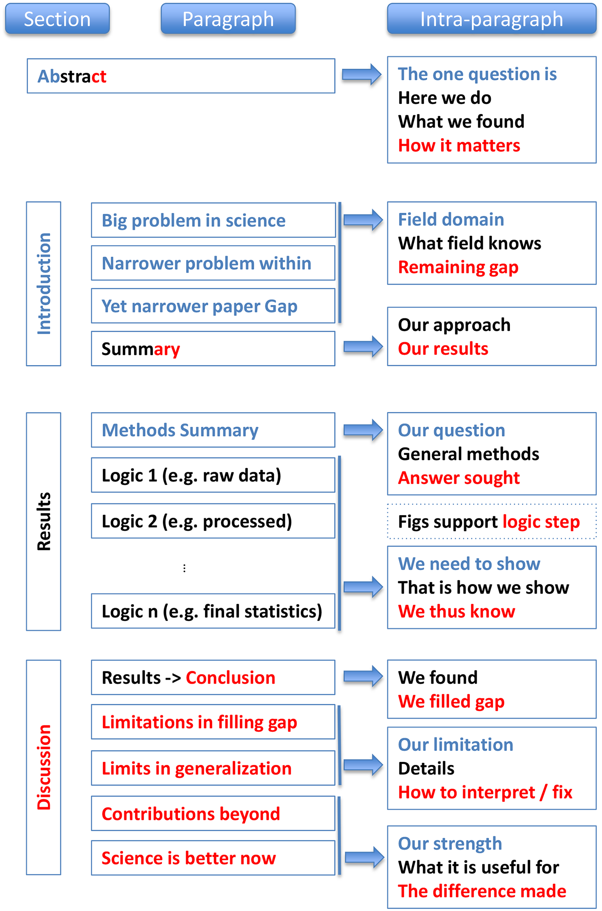

# [Communication in Data Science](/README.md)

***Notes copied from dsc [180A capstone website](https://dsc-capstone.org/2025-26/lessons/04/) as well as sections from this [meta-paper](https://journals.plos.org/ploscompbiol/article?id=10.1371/journal.pcbi.1005619)***.

## Data Science is 75% Talking
Can you explain why you did what you did? Can you justify to your manager the choices and results? We need to acknowledge that communication & soft-scale is hard, they do not have a boundary or an algorithm for doing them:

- Small changes in the presentation changes the presentation itself -> they are cultral, person, even context dependent.
- You are always communicating to somebody, different message for different audience -> different audience focus on different things as everyone's goal is diffeent.
    - An 30-seconds pitch for an investor should be about how great the market is and why they should get in it first will be different from explaining to your grandma why you are exciting about your work.

> ***Tip***: iterate, iterate as much as possible, give to your mentor, give to your friend, even give it to your enemy. If someone who hates you can't tear the argument apart, it must be a good argument. If we need to deliver a good presentation, it is because we want something from the person that we are communicating with, we want to build our argument invinciable.

## A Well Written Science Paper
For each of the component of the paper, we try to paint part of the story:

  

### Abstract
Both the title and abstract must be immediately understandable to readers who are unfamiliar with the work, and should be written in plain language. Remember, **people browse abstracts to determine whether a paper is worth reading further**; they won’t know the technical details of the work before they read it. It’s a good idea to maintain a working title and abstract that you update regularly, just so that it’s clear to you what the focus of the project is. In the abstract, spend roughly one sentence on each of the following four components:

- Contextualizing the problem: What is the world in which the problem lies? Why is this problem relevant?
- Reviewing gaps in prior approaches: What did prior approaches not solve?
- Stating the project’s contribution to the problem: What was the “gap” that we closed, and how did we close it?
- Specifying relevant details to our methods: What are specific hyper-parameters that you used that made a huge difference?

### Introduction
The introduction **sets the context for the rest of the paper**. After the abstract, it is the first part of the paper that readers will read, **and often the only thing they will read**. The introduction will start broad and become narrower and narrower as we add more detail.

  

There are three pieces to an introduction section:

1. An introductory paragraph. The first paragraph in our introduction will start by introducing the context in which our project is relevant. It will then state the problem that we're trying to solve, and summarize some of the key results and their implications.

2. A literature review and discussion of prior work. Here, we will provide context on what has been attempted in the past in the realm of the problem. This will both set up the context in which the problem exists and shed light on why the approach is different.

3. A data description (this is a data science capstone, after all).
    - `Data-focused` (applying existence method for novel data): We should describe why the data we’re using will help address the problem at hand.
    - `Methods-focused` (developing new methods): We should describe the kinds of data that our methods are applicable to. For instance, if we’re developing methods for using convolutional neural networks with graphs, we should describe why graph-based data is useful in the real-world.

More details are provided in [this video produced by previous dsc graduates](https://www.youtube.com/watch?v=X9gbQ7pme1E).

### Methods
This section often goes by different names, e.g. experimental design, and sometimes appears at the start of the “Results” section of a paper rather than as its own section (as we saw in the chart above). Regardless of its title, the purpose of this section is to **describe the steps that we took to produce the results that we’ll discuss in the following section**. It should contain enough details for a reader to be able to understand what you did, without containing so much detail that it distracts from the storyline -> leave ultra-fine details for the appendix.

### Results
We should present data clearly **without any interpretation**. That is, readers of this section should be able to understand what we discovered, without having to read any conclusions that we made from those results -> don’t make readers guess anything.

### Discussion
Now this is where we will provide our interpretation of the results from the previous section. Here, we should describe how our results compare to prior work on the same problem. Are the results similar to what has been seen before? Are they significantly different? Why? Be honest in describing the impact and applicability of the results, along with the limitations of the approach. **There’s nothing wrong with results having limitations**; just be clear on what they are. Lastly, make sure to describe the possibilities for future work. How can someone else take our project and extend it even further?

## Good Habits During Writing
When writing a paper, follow these guidelines:

1. A paper is a narrative essay that describes a problem, methods to solve the problem, and the results of the approach. However, the paper should not read as if it’s a bunch of answers to pre-canned questions back-to-back, a good paper should really **feel like a story**.

2. The narrative that a paper follows should be about the methods and results, not an autobiography of the project and how we worked on it. **Every project produces work that is irrelevant to the results**; DO NOT discuss irrelevant work in the paper.

3. Figures should be self-contained and complete. In fact, we should strive to create figures such that readers can **understand the high-level takeaways of the paper just by looking at the figures**.

4. Keep in mind that **we will know our work much better than almost anyone else who will ever read it**; make sure to be careful to include all necessary details and not make assumptions about what the reader knows about the project.

5. Cite others’ work frequently. Learning from and using others’ research is something to be proud of! However, don’t throw in a bunch of citations just to have them, **only discuss and cite work that’s relevant**.