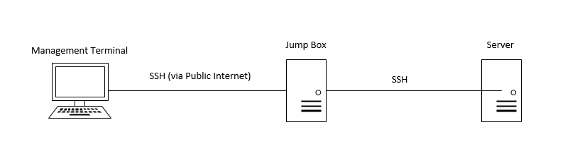

# DSMLP Access

[Back to home](/README.md)

***Notes copied from dsc [180A capstone website](https://dsc-capstone.org/2025-26/lessons/01/) as well as from [tips here](https://docs.google.com/document/d/1qTMl8xLlX0jkEaGetrwTxa0zqeYSWDSvZ9k17TSNSC0/edit?tab=t.0)***

## Launching Pod

DSMLP is a Kubernetes cluster on which we can run processes in Docker containers; a Docker container is a package that contains everything needed to run an application (e.g. specific code, tools, and libraries), and Kubernetes is a tool that “orchestrates” containers, making sure each one has access to the resources it needs. To enter DSMLP from terminals:

```
ssh kbian@dsmlp-login.ucsd.edu
```



Now, we’ve been placed into an initial “jumpbox” server. Think of this initial server as the lobby of a hotel – we could sleep here, but we probably want an actual room, i.e. an actual server. To specify which actual server we want to use, we need to run a launch script. There are several default launch scripts that exist, that initialize pre-configured servers with common tools pre-installed (like pandas and Jupyter Notebooks). When using a default launch script, there will always be some default amount of RAM, CPU, and GPU resources allocated, but we can provide flags when running the launch script to change these. For instance

```
launch-scipy-ml.sh -W DSC180A_FA25_A00
```

This will initialize a server with 2 CPUs, 8 GB of RAM, and no GPUS, which are the default settings for the `launch script launch-scipy-ml.sh`. If we instead wanted to ask for 8 CPUs and 32 GB of RAM, we could have run `launch-scipy-ml.sh -W DSC180A_FA25_A00 -c 8 -m 32`. This is not the only script that exists; for instance, we could have used `launch-scipy-ml-gpu.sh`.

The `-W DSC180A_FA25_A00` tells DSMLP that we’d like to use the DSC 180A workspace, which means that we’ll be able to access any files that we choose to share with the whole class, or even just the specific section. For instance, if the mentor has a really large file they’d like the entire section to be able to access, they can upload it to DSMLP once and, through the `DSC180A_FA25_A15 workspace`, all students in the section will be able to access it through running the following with specific `<team_id>` (retreived by `launch-scipy-ml.sh -W DSC180A_FA25_A00 -G list`):

```
launch-scipy-ml.sh -W DSC180A_FA25_A00 -G <team_id>
```

This prevents us from having to transfer the file to DSMLP individually. Use `launch-scipy-ml.sh -h` to see all of the possible launch options.

## Jupyter Notebooks and DSMLP

If we directly copy the URL, we will get an error because we still haven't got this particular server port running on our local computer. We will need to do the following:

### Port Forwarding

Let’s take a closer look at the example link provided above.

```
http://dsmlp-login:16425/user/kbian/?token=cd03e257e978060cbdca539be321e8e1147a17ac9366bad66a6b5647baa71094
```

Here, there are two components:
1. A port, `16425` which appears right after `dsmlp-login`.
2. A token, `cd03e257e978060cbdca539be321e8e1147a17ac9366bad66a6b5647baa71094` which is used for later token password login.

Open new terminals and then do the following before opening `http://localhost:8889/user/kbian/tree/`

```
ssh -N -L 8889:dsmlp-login.ucsd.edu:16425 kbian@dsmlp-login.ucsd.edu
```

If changing `tree` to `lab` in the URL, we’ll be brought to Jupyter Lab, the latest version of the Jupyter Notebooks interface. Jupyter Lab is an IDE, complete with a Terminal and text editor. If seeing an error message saying `channel 2: open failed: connect failed: Connection refused`, it's likely due to entering the wrong port number or the same port is being used elsewhere on the computer, like in another Terminal window.

If `http://localhost:8889` doesn’t open or you see a connection refused error, try the following steps to troubleshoot:

1. Check if port 8889 is already in use:
    ```
    lsof -i :8889
    ```

    If it returns a process using the port, kill it using:
    ```
    kill <PID>
    ```

2. Find the IP address of the server:
    ```
    nslookup dsmlp-login.ucsd.edu
    ```
    Look for an IP address like 128.54.65.160.

3. SSH using the IP address instead of the hostname, this will log into the server under your name:
    ```
    ssh kbian@128.54.65.160
    ```

4. Then do port forwarding directly on dsmlp by using the IP:
    ```
    ssh -N -L 8889:128.54.65.160:16425 kbian@128.54.65.160
    ```
    and then open this URL on your local browser:
    ```
    http://localhost:8889/user/kbian/tree/
    ```

The reason of this issue is that the Jupyter server may be running on a compute node or internal network, and forwarding through `dsmlp-login.ucsd.edu`, which is the login node, doesn’t always route traffic correctly. Using the server’s IP address that we get from the login node ensures your connection reaches the right machine and port. When prompted for a “Password or token”, enter the token you just found.

To make later login more simple, we can setup [SSHKeys following this link](https://www.digitalocean.com/community/tutorials/how-to-set-up-ssh-keys-2).