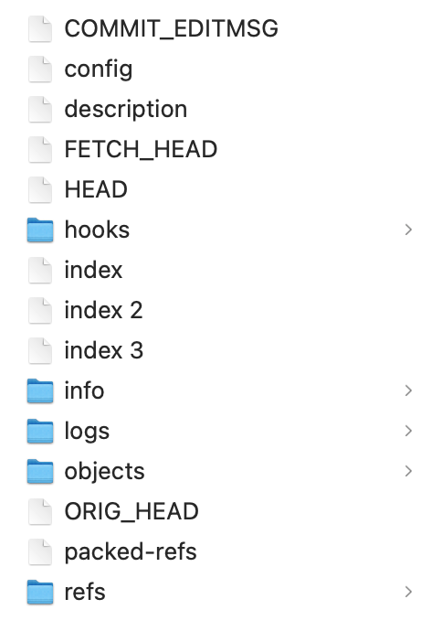
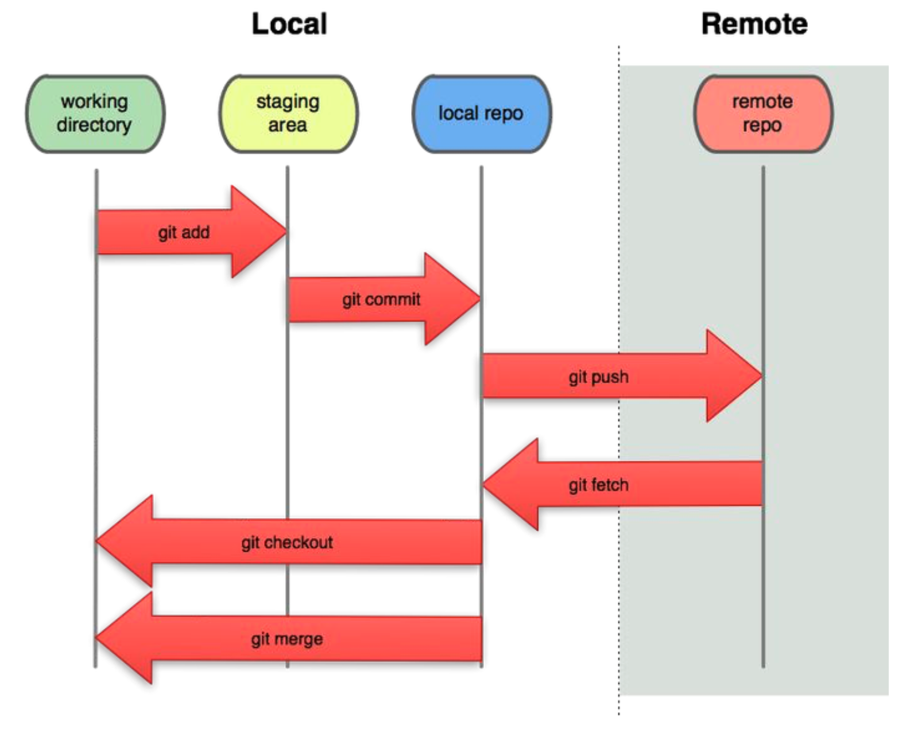
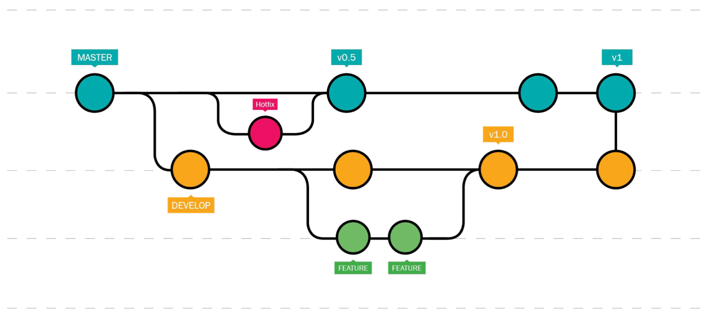

# [Git Distributed Control](/README.md)

***Notes copied from dsc [180A capstone website](https://dsc-capstone.org/2025-26/lessons/06/)***

## A Snapshot

The core building block of Git is the **snapshot**. A snapshot records what files look like at a particular instance in time. Note that Git ***only stores the differences between snapshots***, rather than entire copies of the repository at every snapshot. This makes the version history dramatically smaller. However, this only works efficiently in cases where Git is good at determining the difference between files. This is generally true for text-based files, but not in the case of binary files, which are how images are stored in notebooks.

- Notebook that programatically generates plots or images and repeatedly commit versions of that notebook, Git will end up storing copies of each version of the notebook, which will lead to large repository sizes.

In Git-speak, the act of creating a snapshot (i.e. saving your work) is called committing. A commit consists of:
1. Information on how the files changed from the previous commit.
2. A reference to the previous commit (project’s version history is like a linked list of commits!).
3. A unique identifier (hash code).

## Repository

A repository is a collection of files and their version history. This history lives in a hidden directory called `.git` at the root level of a Git-initialized repository. To add Git tracking features to an existing folder, run `git init`; however, we often won’t have to do this directly since it’s common to initialize a repository directly on GitHub and git clone it locally, at which point a `.git` folder already exists. The `.git` directory of a repository contains:
1. An index of all files being tracked by Git.
2. Commit hashes and “diffs” (the differences between commits).
3. The remote address of a repository on GitHub, if one is set up. This remote repository is known as the origin, as in, where the repository was originally cloned from.

  

Most of the `.git` folder is not exactly human readable. There are a few different “places” in which we will work in a repository on the computer:
- The **working directory** is the file system that we see on the local machine, that contains the files we're editing.
- The **staging area** consists of the files that we’d like to include in our next commit. Add a file to the staging area by running `git add <file name>`. We can see the files in staging by running `git status`.
- A **snapshot** saves the state of the staging area when we make a commit. If we don’t add a file to the staging area, its changes will not be saved in the commit.

> Again, Git is a distributed control system and GitHub is a server platform that uses Git, so all the interaction we are doing with GitHub is really interaction with this remote server that we are on.

  

To download the changes made by someone else to a remote repository, we fetch the changes by running `git fetch`. This brings the changes to our local repository, but not into our working directory. The command we’re more familiar with is `git pull`, which is a combination of `git fetch` and `git merge`, which merges the remote repository into your working directory.

After committing changes to the local repository, in order to add them to the remote repository, we `git push`. This is a shortcut for `git push origin main`, which specifies that we want to push to the remote repository using the changes in the main branch of our local repository. Always exercise caution when pushing changes to the remote repository, especially in the main branch!

## Branching

A “branch” is an independent copy of the files in a repository. The repository has a single main branch, which should contain the latest runnable version (“production” branch).

SIngle branch workflow can get messy quickly when working with others. Imagine the following scenario:

- We pull the remote repository.
- Teammate pulls the remote repository and makes changes to files A and B.
- We make changes to files A and B without repulling.
- We try to push our changes to files A and B, but our push is rejected, because Git doesn’t know how to combine our changes with the teammate’s changes.

This is known as a merge conflict. When working on larger projects, this single-branch workflow gets messy quickly, and there’s a better solution to use multiple branches.

### Multiple-Branch Workflows
One creates a branch by “branching off” an existing branch, most commonly the main branch. Let’s look at an example workflow.

  

- The blue-ish nodes represent the main branch, which contains the latest runnable version of a project’s code – it always “work.”
- The yellow nodes represent a develop branch, which is used for experimentation. From there, more branches are created to implement specific features, in order to not introduce any errors in the develop branch.
- The pink node represents a hotfix branch, is was created to fix a bug in main that has nothing to do with the work in develop. After making commits in the hotfix branch, the hotfix branch is merged back into main, which now reflects the latest changes from hotfix.
Eventually, the develop branch is merged back into main, at which point main will contain new, working features.

Branches should be named and separated based on features; create one branch for updating data cleaning code, another branch for updating model’s features, etc. If one person is working on multiple unrelated tasks in a single repository, they should use a different branch for each task, too. One may elect to include team members’ initials in branch names, e.g. SR_etl.

> Note that the purpose of branching is not to avoid merge conflict but to structure merge conflict to a containable situation and we know what is important to merge in.

### Example of Multiple-Branch Workflows

Suppose we have a working main branch and want to update our ETL code to add a new data source.

1. Create a new branch off main for updating ETL code and switch to it, using `git checkout -b update_etl`.
2. Do work in update_etl.
3. Add and commit changes, e.g. `git add etl.py` and `git commit -m "Updated ETL pipeline."`.
4. Push update_etl to remote, using `git push` (or `git push origin update_etl`).

Once we’ve finished working in the update_etl branch, we’ll need to merge it back into main. To do so:

1. Switch to main, using `git checkout main`.
2. Pull the latest version of main, using `git pull`.
3. Switch back to update_etl, using `git checkout update_etl`.
4. Merge main into update_etl, using `git merge main`. This will require fixing merge conflicts.
5. Push the latest version of update_etl back to remote.
6. Make a pull request on GitHub, telling other team members what we’ve changed and asking them to review our work.
7. Team members, if they approve, will merge the pull request directly from the website. Now, main will reflect the changes from update_etl.
8. Delete our feature branch.
9. Locally, switch back to main and pull, using `git checkout main` and `git pull`.

> Note that reviewing pull requests for merging is a good way to “get up to speed” on what everyone else did that week!

## Version Control and Notebooks
Under the hood, Jupyter Notebooks are stored as JSON, a file format for storing data. Unfortunately, fixing merge conflicts is notoriously difficult in JSON, particular when code output is present. After all, Git is meant to version code, but notebook outputs are data.

There are two kinds of notebooks
- **Notebooks in which code is prototyped**: Code prototyping notebooks should be personal and not used for collaboration. Whenever we write code that others need to use, it should be stored as library code (e.g. as functions in a .py file). If we’d to commit development notebooks, never commit them to main.

- **Notebooks that generate code-driven reports**: Code-driven reports should be versioned, but always clear output before committing, so that only code is versioned! Additionally, reports should always be quick to run; if not, save intermediate steps to files so that the report is generated quickly.

If we want to commit output (e.g. a report), export a static document (e.g. HTML or PDF) into the docs directory of the repository.