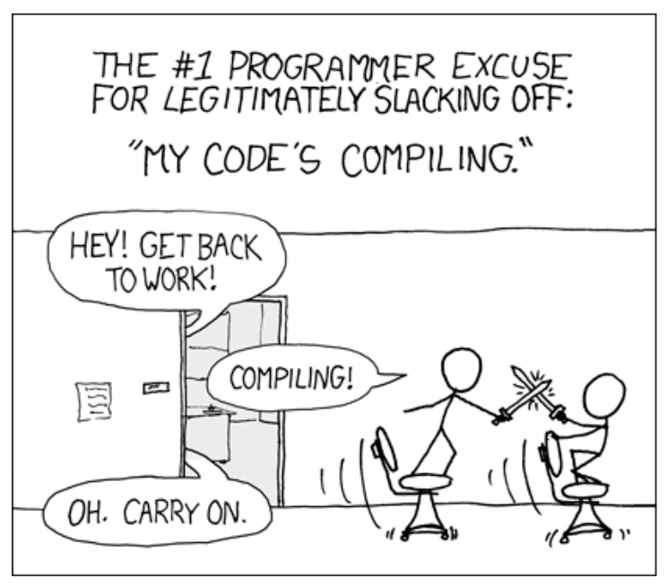

# [GPU Access](/README.md)

***Notes copied from dsc [180A capstone website](https://dsc-capstone.org/2025-26/lessons/02/)***

## Getting GPU
CPU is good at fetching small amounts of memory quickly (5 * 3 * 7) while the GPU is good at fetching large amounts of memory (Matrix multiplication: (A * B) * C), so for most cases of this capstone, we will be running on GPU, better utilizing the power of parralization of Transformers.

- DSMLP has several GPUs from NVIDIA available for you to use. By default, DSMLP only allows users to request a single GPU core, which we can do by using the flag `-g 1`. Make sure to use lowercase `g`, which stands for GPU, not `G`, which stands for group. ***Note*** that if we want to run on multiple GPU, we need to ensure that our code base is parralizable.

    - **Multiple Core**: To request multiple cores, we must do so in low priority mode. By using the additional flag `-p low`, we can request up to 8 GPU cores, but note that in low priority mode, if someone else requests the resources we're using, we may be exited from the container. To request 4 GPU cores: `-g 4 -p low`.

    - **Specific GPU**: To see which nodes have which GPUs and the number of unused GPU cores per node, go to the [DSMLP status page](https://datahub.ucsd.edu/hub/status). Use `-n` flag to specify which node we like to use. For instance, if we want to use node n30, which has a GTX A5000, we can use the flag `-n 30` (not `-n n30`). If the node has 6 of its 8 GPU cores being used, then we can’t request any more than 2 GPU cores. To request a specific type of GPU, we can use the `-v flag` (for example, `-v 1080ti`).

        - Example of it would be like:
            ```bash
            launch-scipy-ml.sh -W DSC180A_FA25_A00 -g 1 -n 24
            ```

        - If no node request is made, we will be automatically asigned and the assignment will show when launching the container. Something like:
            ```bash
            Wed Oct 11 10:44:35 PDT 2023 INFO pod assigned to node: its-dsmlp-n04.ucsd.edu
            ```
            telling that we are in node 4.

        - If we don’t request any GPUs, we will still be in a node that has GPUs, we just won’t have access to any of them. Check the typf of GPU you are getting as the following:
            ```bash
            python -c "import torch; print(torch.cuda.get_device_name(0));"
            ```
            and something like the following may show up:
            ```bash
            NVIDIA GeForce RTX 2080 Ti
            ```

## Adapting to Specific Libraries
Different machine learning libraries have different ways of enabling GPU based computation. An example of using PyTorch features are shown in [this notebook](/notebooks/gpu-example.ipynb).


## DSMLP and Kubernetes

While we can only work for so many hours a day, servers (like DSMLP) can run 24/7. We need to initiate jobs that run for hours, or even days, on DSMLP. We shouldn't be setting in front of our computer and just wait for code to run.

<p align="center">
  
</p>


In order to do this, we need:

- A server that can run even after we log out. As we’ll see, we can make DSMLP behave this way. Note that vanilla DataHub doesn’t work this way – after 20 minutes of inactivity, DataHub disconnects you.

- Code that doesn’t require human interaction.
    - The job is going to run for minutes or hours without any intervention, we need to be able to run a single command, e.g. a build script, that runs our entire workflow.

- Code that is largely correct.
    - We don’t want to wait hours before figuring out that our code is incorrect!

-  Good logging.
    - Debugging is more difficult, the outputs of print statements won’t be captured.

Remanber that DSMLP is a Kubernetes cluster. Kubernetes is a platform that manages, or orchestrates, containerized workloads. It is the system that manages which containers receive which resources on DSMLP (Fun fact: Kubernetes is often shortened to “K8S” because there are 8 letters between the K and s in Kubernetes).

When we run a launch script on DSMLP, we are requesting a Kubernetes pod, but we need to some how interact with the underlying Kubernetes infrastructure in order to initiate a long-running job in a pod. While on the DSMLP jumpbox server, there are two Kubernetes-related command-line tools to know about:

- `kubectl`, which stands for “Kubernetes control”, allows us to list and delete pods associated with the current user.
- `kubesh`, which stands for “Kubernetes shell”, allows us to connect to the shell (command-line) in a specified pod.


## Launching Background Job

To launch a background pod, that is, a pod in which we will initiate a long-running job, we use the `-b` flag when running a launch script. For instance, we may run `launch-scipy-ml.sh -W DSC180A_FA25_A00 -g 1 -c 4 -b` to create a background-enabled pod with 1 GPU and 4 CPU cores. When using the -b flag, notice that we are not put into the pod that we requested. Instead, the pod is simply created:

- The resulting output contains the pod ID like kbian-27068, which we’ll need to remember in order to interact with the pod. In order to actually enter the pod, we can run `kubesh <pod-id>`, e.g. `kubesh kbian-27068`.

- **One good way to validate if this worked correctly is by seeing that your host name is still `[kbian@dsmlp-login]`, signaling that you are still at the jump box page, not in the instance we ahve created yet**.

- The default timeout, according to the DSMLP documentation, is 6 hours. If we need to need a pod to run for up to 12 hours, we can specify this by writing a custom launch script; see [here](https://support.ucsd.edu/services?id=kb_article_view&sysparm_article=KB0032273&sys_kb_id=b18fd328dbe2dcd04cd8f06e0f961988) for instructions on how to do so (we may also want to do this if we’ve gotten annoyed of writing out several flags each time we want to launch a pod).

Handy commands:

- `kubesh <pod-id>` launches a pod.
- `kubectl get pods` lists all pods.
- `kubectl delete pod <pod-id>` deletes a pod.
- Adding the `&` after a call to python in the command-line, e.g. `python run.py test data &`, runs your Python process in the background without taking over the command prompt.
- `ps` lists all of the current processes and their IDs.
- `kill <process-id>` kills a process.

## Logging Background Job
When we initiate background tasks, we don’t typically have access to the command-line outputs (e.g. print statements) of our code. As such, it can be particularly difficult to debug when and why something went wrong. In this setting, the cost of trial-and-error is high, since each “trial” takes a long time to run. Solution is to save logs to a file that you can inspect afterwards:

1. The most rudimentary way to do this, if you’re already using “print debugging”, is to use the `>` keyword when calling python from the command-line. For instance,
    ```bash
    python run.py all > log.txt &
    ```

2. A better solution is to use the built-in `logging` module. It automatically records a timestamp each time it is called, along with which file and function the logging occurred in. we can customize the granularity and frequency of the logs to match your use case. For instance:

    ```python
    import logging
    import numpy as np

    logging.basicConfig(filename='log.txt', 
                filemode='a', 
                level=logging.INFO,
                datefmt='%H:%M:%S',
                format='%(asctime)s,%(msecs)d %(name)s %(levelname)s %(message)s')

    def myfunc():
        a = np.random.randint(-5, 5)
        b = np.random.randint(-5, 5)

        if b == 0:
            logging.info('zerodivisionerror preempted')

        else:
            return a / b

    print([myfunc() for _ in range(100)])
    ```
3. Even better is to use WandB logging directly.